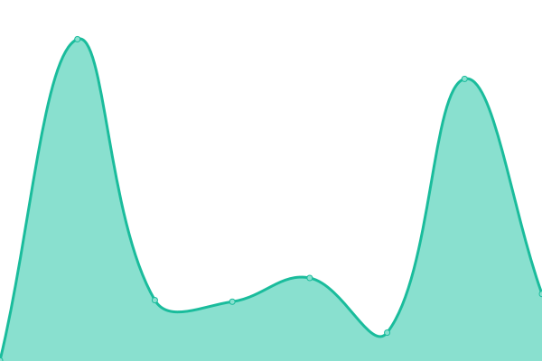

# [📈 Live Status](https://hcsc-25th.github.io/upptime): <!--live status--> **🟩 All systems operational**

This repository contains the open-source uptime monitor and status page for [竹中科研 25 屆](https://hcsc-25th.github.io/), powered by [Upptime](https://github.com/upptime/upptime).

With [Upptime](https://upptime.js.org), you can get your own unlimited and free uptime monitor and status page, powered entirely by a GitHub repository. We use [Issues](https://github.com/hcsc-25th/upptime/issues) as incident reports, [Actions](https://github.com/hcsc-25th/upptime/actions) as uptime monitors, and [Pages](https://hcsc-25th.github.io/upptime) for the status page.

<!--start: status pages-->
<!-- This summary is generated by Upptime (https://github.com/upptime/upptime) -->
<!-- Do not edit this manually, your changes will be overwritten -->
<!-- prettier-ignore -->
| URL | Status | History | Response Time | Uptime |
| --- | ------ | ------- | ------------- | ------ |
|  [NSSM](https://sc2022.wixsite.com/nssm) | 🟩 Up | [nssm.yml](https://github.com/hcsc-25th/upptime/commits/HEAD/history/nssm.yml) | 

 798ms
     
 | 

<a href="https://hcsc-25th.github.io/upptime/history/nssm">100.00%</a>
    

|  [HCSC 25TH](https://hcsc-25th.github.io/) | 🟩 Up | [hcsc-25-th.yml](https://github.com/hcsc-25th/upptime/commits/HEAD/history/hcsc-25-th.yml) | 

 95ms
     
 | 

<a href="https://hcsc-25th.github.io/upptime/history/hcsc-25-th">100.00%</a>
    

|  [Facebook](https://www.facebook.com/) | 🟩 Up | [facebook.yml](https://github.com/hcsc-25th/upptime/commits/HEAD/history/facebook.yml) | 

 193ms
     
 | 

<a href="https://hcsc-25th.github.io/upptime/history/facebook">100.00%</a>
    

|  [Instagram](https://www.instagram.com/) | 🟩 Up | [instagram.yml](https://github.com/hcsc-25th/upptime/commits/HEAD/history/instagram.yml) | 

 538ms
     
 | 

<a href="https://hcsc-25th.github.io/upptime/history/instagram">100.00%</a>
    

|  [Linktree hcsc25](https://linktr.ee/hcsc.25th) | 🟩 Up | [linktree-hcsc25.yml](https://github.com/hcsc-25th/upptime/commits/HEAD/history/linktree-hcsc25.yml) | 

 208ms
     
 | 

<a href="https://hcsc-25th.github.io/upptime/history/linktree-hcsc25">100.00%</a>
    

|  [bio.link hcsc25](https://hcsc_25th.bio.link/) | 🟩 Up | [bio-link-hcsc25.yml](https://github.com/hcsc-25th/upptime/commits/HEAD/history/bio-link-hcsc25.yml) | 

 288ms
     
 | 

<a href="https://hcsc-25th.github.io/upptime/history/bio-link-hcsc25">100.00%</a>
    

|  [hcsc25 standby site](https://hcsc-25th.codeberg.page/) | 🟩 Up | [hcsc25-standby-site.yml](https://github.com/hcsc-25th/upptime/commits/HEAD/history/hcsc25-standby-site.yml) | 

 772ms
     
 | 

<a href="https://hcsc-25th.github.io/upptime/history/hcsc25-standby-site">100.00%</a>
    

|  [hcsc25 odysee](https://odysee.com/@hcsc-25th:e) | 🟩 Up | [hcsc25-odysee.yml](https://github.com/hcsc-25th/upptime/commits/HEAD/history/hcsc25-odysee.yml) | 

 412ms
     
 | 

<a href="https://hcsc-25th.github.io/upptime/history/hcsc25-odysee">100.00%</a>
    

|  [hcsc25 youtube](https://www.youtube.com/channel/UCWjF0P7tWPG4x5DjNxPuuNQ) | 🟩 Up | [hcsc25-youtube.yml](https://github.com/hcsc-25th/upptime/commits/HEAD/history/hcsc25-youtube.yml) | 

 256ms
     
 | 

<a href="https://hcsc-25th.github.io/upptime/history/hcsc25-youtube">100.00%</a>
    

<!--end: status pages-->

[**Visit our status website →**](https://hcsc-25th.github.io/upptime)

## 📄 License

- Powered by: [Upptime](https://github.com/upptime/upptime)
- Code: [MIT](./LICENSE) © [竹中科研 25 屆](https://hcsc-25th.github.io/)
- Data in the `./history` directory: [Open Database License](https://opendatacommons.org/licenses/odbl/1-0/)
